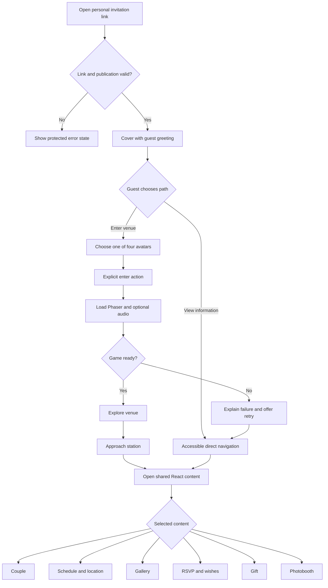
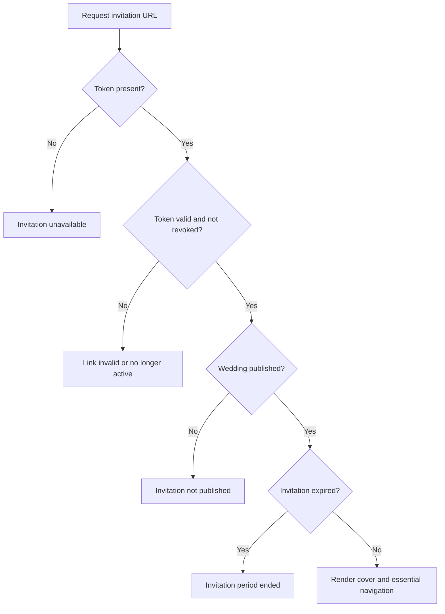
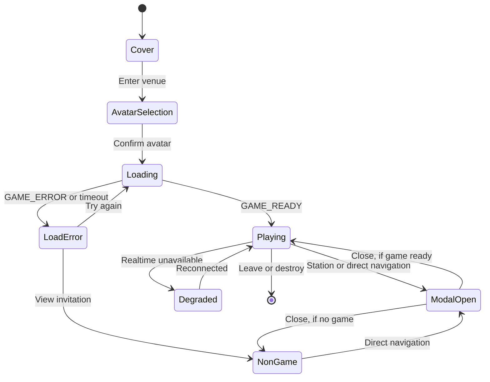
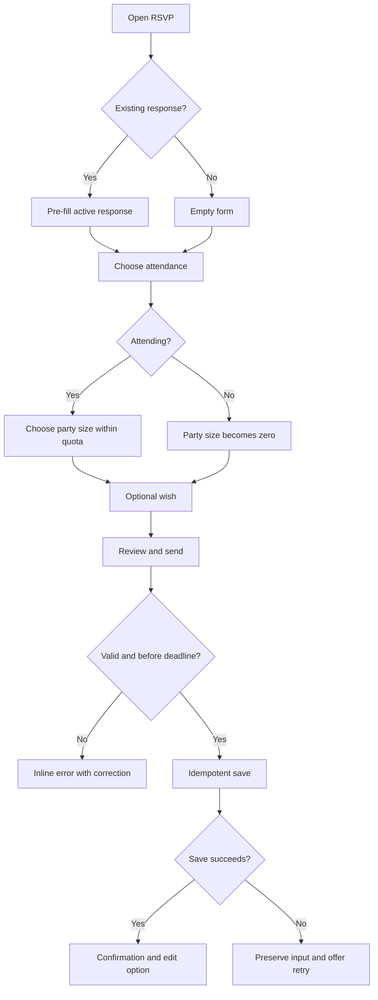
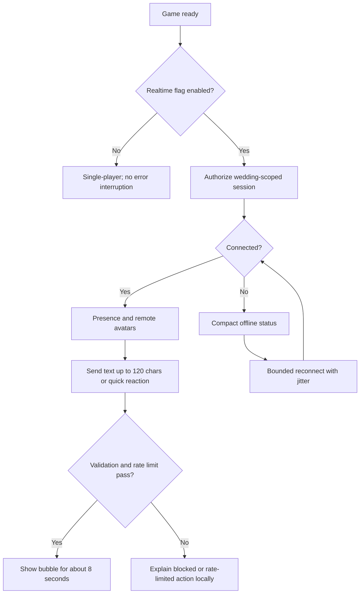
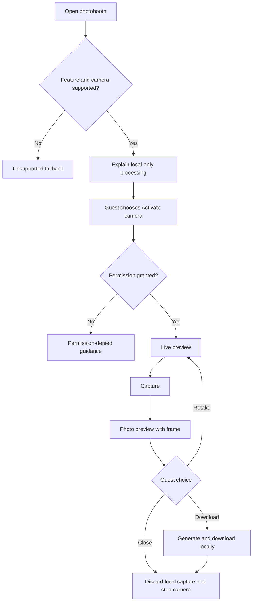

# User Flows — Wedding Quest

**Status:** Approved  
**Task:** M0-03  
**Design direction:** Taman Senja Nusantara  
**Source:** `docs/PRODUCT_BRIEF.md`, `CR-001`, and `.impeccable.md`

Approved by the product/design owner on 2026-09-15.

## Acceptance criteria

- The valid-link guest journey covers cover, avatar selection, game entry, direct navigation, stations, RSVP, realtime, and photobooth.
- Essential information remains reachable before and without Phaser.
- Invalid, expired, revoked, unpublished, offline, realtime-disabled, permission-denied, and unsupported-device paths have deterministic outcomes.
- A station action and direct navigation open the same React-owned content state.
- Modal opening disables game input; modal closing restores focus and input safely.
- Keyboard, touch, reduced-motion, and screen-reader alternatives are represented.

## 1. Primary guest flow

The direct-information action is visible on the cover and remains available during game loading. Entering the venue is never required to read essential information or submit RSVP.

## 2. Invitation access states

Error responses must not reveal whether another guest exists, show sequential IDs, or expose token values. Every unavailable state provides a safe retry or contact-the-host instruction configured per deployment.

## 3. Game lifecycle and fallback

Lifecycle rules:

- Loading Phaser starts only after an explicit enter action.
- Direct navigation works in `Cover`, `Loading`, `LoadError`, `Playing`, and `Degraded` states.
- Opening a modal sends `SET_INPUT_ENABLED: false` and clears active movement.
- Closing restores focus to the trigger and enables input only when no other blocking overlay remains.
- Blur, visibility change, pointer cancellation, and teardown clear movement.
- Re-entry creates one Phaser instance and one canvas only.

## 4. Shared content navigation

All entry points resolve to one React-owned content identifier:

| Entry point | Input | Result |
|---|---|---|
| Bottom navigation | Tap/click or keyboard activation | Open selected content modal |
| Nearby station | Action button, `Enter`, or configured game action key | Emit station ID, map to the same modal |
| Deep link | Valid content route/hash | Open the same modal after invitation validation |
| Non-game fallback | Accessible section link | Open the same content; no Phaser dependency |

If two interaction zones overlap, Phaser chooses the nearest eligible station deterministically. React owns the modal stack and Escape closes only the topmost dismissible layer.

## 5. RSVP flow

The submit label is outcome-specific: `Kirim konfirmasi` for the first response and `Simpan perubahan` for an update. No optimistic success is shown before the durable write succeeds.

## 6. Realtime and ephemeral chat

Chat has no visible history and is not stored in PostgreSQL. A connection failure never opens a blocking modal. The operator can disable chat globally or block a session server-side.

## 7. Photobooth flow

The camera stream stops on close, navigation away, visibility loss where appropriate, or teardown. No capture, thumbnail, or biometric/media payload is sent to the server.

## 8. Keyboard and assistive-technology flow

1. A skip link moves focus directly to invitation information.
2. Cover actions and avatar choices are reachable in logical DOM order.
3. Avatar selection uses a labelled single-choice group with arrow-key behavior.
4. Direct navigation remains available without interacting with the canvas.
5. Modal focus moves to its heading or first meaningful control, stays trapped, and returns to the invoking control when closed.
6. Status updates use appropriately polite live regions; decorative game changes are not announced continuously.
7. Reduced-motion removes optional spatial transitions and reduces nonessential game effects.
8. At 200% zoom, essential content reflows without horizontal scrolling except intrinsically scrollable gallery regions.

## 9. Exit and recovery rules

| Event | Required behavior |
|---|---|
| Pointer cancel, window blur, or hidden document | Clear movement immediately |
| Modal opens | Clear movement, disable local input, preserve game instance |
| Modal closes | Restore trigger focus and re-enable input if safe |
| Realtime disconnects | Keep game/content working and show compact status |
| Camera permission denied | Keep modal usable, explain browser setting, provide close action |
| Phaser load fails | Keep direct information navigation and offer retry |
| Invitation request fails | Show safe error copy and retry without leaking token details |
| Browser back | Close top content layer first; do not duplicate game/canvas |
